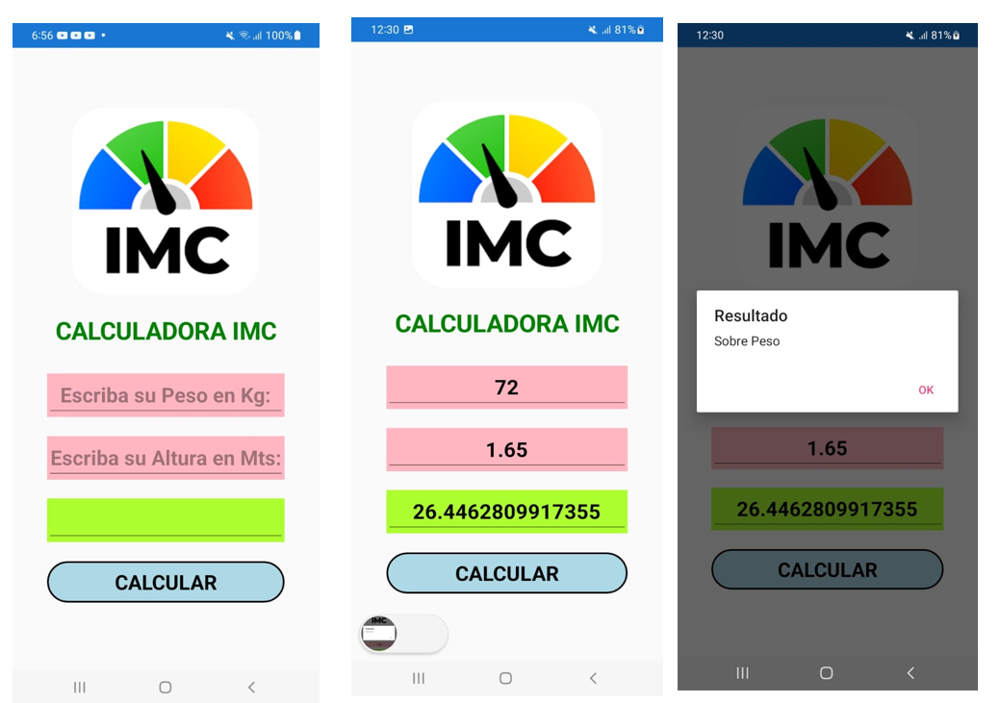

# DOCUMENTACION_PROYECTO_IMC
DOCUMENTACION_PROYECTO_IMC

## Crear una Calculadora IMC

###
El índice de masa corporal (IMC) es un método utilizado para estimar la cantidad de grasa corporal que tiene una persona, y determinar por tanto si el peso está dentro del rango normal, o por el contrario, se tiene sobrepeso o delgadez. Para ello, se pone en relación la estatura y el peso actual del individuo. 

## PORTADA:

